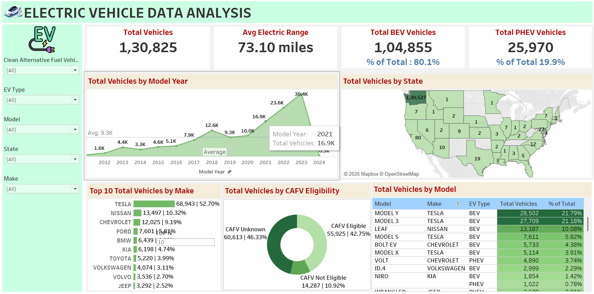

# EV-Data-Analysis - Tableau
## Project Objective
To analyze the landscape of Electric Vehicle (EV) adoption within a specific region (primarily Washington State).By evaluating the distribution of vehicle types, manufacturer dominance, and battery technology trends, 
the project aims to provide data-driven insights for urban planning, utility resource allocation, and automotive market strategy.
## Objectives
- Segment Vehicle Technology: Differentiate between Battery Electric Vehicles (BEVs) and Plug-in Hybrid Electric Vehicles (PHEVs) to understand consumer preference.
- Manufacturer Market Share: Identify leading OEMs (Original Equipment Manufacturers) and their impact on the local EV ecosystem.
- Geographic Density Mapping: Pinpoint "hotspots" of EV ownership by County and City to assist in charging infrastructure placement.
- Regulatory Compliance Analysis: Assess the percentage of vehicles that meet Clean Alternative Fuel Vehicle (CAFV) eligibility requirements.
- Temporal Growth Tracking: Examine model year distributions to evaluate the acceleration of EV adoption over time.
## KPI"S Performances:
### KPI Cards
1. Total Vehicles:
- Understand the overall landscape of electric vehicles, encompassing both BEVs and PHEVs, to assess the market's size and growth.
2. Average Electric Range:
- Determine the average electric range of the electric vehicles in the dataset to gauge the technological advancements and efficiency of the EVs.
3. Total BEV Vehicles and % of Total BEV Vehicles: 
- Identify and analyze the total number of Battery Electric Vehicles (BEVs) in the dataset.
- Calculate the percentage of BEVs relative to the total number of electric vehicles, providing insights into the dominance of fully electric models.
4. Total PHEV Vehicles and % of Total PHEV Vehicles:
- Identify and analyze the total number of Plug-in Hybrid Electric Vehicles (PHEVs) in the dataset.
- Calculate the percentage of PHEVs relative to the total number of electric vehicles, offering insights into the market share of plug-in hybrid models.
### KPI Charts Requirement
1. Total Vehicles by Model Year (From 2010 Onwards):
Visualization: Line/ Area Chart
Description: This chart will illustrate the distribution of electric vehicles over the years, starting from 2010, providing insights into the growth pattern and adoption trends.
2. Total Vehicles by State:
Visualization: Map Chart 
Description: This chart will showcase the geographical distribution of electric vehicles across different states, allowing for the identification of regions with higher adoption rates.
3. Top 10 Total Vehicles by Make:
Visualization: Bar Chart 
Description: Highlight the top 10 electric vehicle manufacturers based on the total number of vehicles, providing insights into the market dominance of specific brands.
4. Total Vehicles by CAFV Eligibility:
Visualization: Pie Chart or Donut Chart
Description: Illustrate the proportion of electric vehicles that are eligible for Clean Alternative Fuel Vehicle (CAFV) incentives, aiding in understanding the impact of incentives on vehicle adoption.
5. Top 10 Total Vehicles by Model:
Visualization: Tree map
Description: Highlight the top 10 electric vehicle models based on the total number of vehicles, offering insights into consumer preferences and popular models in the market.
## Dashboards
### Tableau dashboard
  
## Insights:
- Tesla’s Market Dominance: Preliminary data suggests a heavy concentration of Tesla vehicles (Model 3 and Model Y), indicating strong brand loyalty and a successful early-mover advantage in the region.
- The "Range Gap": There is a visible divide between older EV models (with ranges under 100 miles) and newer models surpassing 200–300 miles. This highlights the rapid advancement in battery density over the last 5 years.
- Urban-Centric Adoption: The population is heavily concentrated in major hubs (like King County/Seattle), while rural areas show significantly lower adoption rates, likely due to "range anxiety" and lack of public charging.
- Hybrid Utility: PHEVs (like the Jeep Grand Cherokee or Chrysler Pacifica) remain popular for larger vehicle classes (SUVs/Vans), suggesting that consumers still prefer a gasoline backup for heavier or long-distance vehicles.
- Incentive Influence: A significant portion of the fleet is "CAFV Eligible," proving that state and federal tax incentives are a major driver for consumer purchase decisions.
## Recommendations:
- Utilities should prioritize transformer upgrades and public fast-charging stations in high-density areas identified in King and Snohomish counties.
- To bridge the geographic gap, policymakers should offer additional "Rural EV" incentives or invest in long-corridor fast charging to encourage adoption outside of city centers.
- As battery technology improves, marketing efforts should focus on moving PHEV owners toward full BEVs by highlighting the lowering costs of maintenance and increasing range.
- For future reporting, ensuring the "Base MSRP" field is consistently populated would allow for better economic analysis of EV affordability across different demographics.
## Critical Takeways:
- The high concentration of EVs in specific postal codes suggests that local power grids in those areas may face higher stress during peak "at-home" charging hours.
- The presence of many 2022 and 2023 models indicates that the EV market is no longer a niche "early adopter" phase but has entered the early majority phase of the product lifecycle.
- While Tesla leads, the entry of traditional brands (Hyundai, Kia, BMW, Jeep) is beginning to fragment the market, providing consumers with more diverse body styles beyond sedans.
## Author
Name: Makala Deepak
📧 Contact: [Makala Deepak](https://www.linkedin.com/in/makala-deepak-63471425a/)
